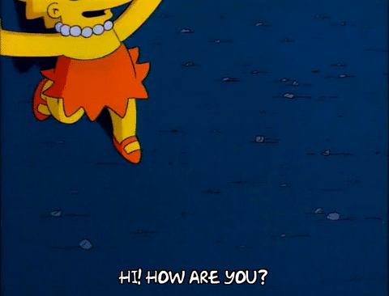

### Hii, my name is Yasmin Mônico (❀◡❀) 
 

</img>
 
### 💗👩🏽‍💻 FullStack Developer | Programming Instructor 
 
- 💻My nickname is YaYa or Yas, I'm an aspiring FullStack programmer and instructor Front-End developer in constantly evolving.
 
- 🎓Currently Recently graduated from [Fac.COTEMIG](https://www.cotemig.com.br/) 
 
I am diving head first into the world of technology. 
My goal is to combine programming knowledge with my passion for science. 
 
### 📚 What I'm doing 
- 🧐 Improving my web development skills at [Proz Educação](https://prozeducacao.com.br). 
 
- 🔭 Working on digital social inclusion projects at RB, which involve teaching programming and robotics. 
 
###🌱 Technologies I'm learning 
- 💻 JavaScript, React, MYSQL and Node.js are some of the technologies I'm dedicating myself to at the moment. 
- 🤓 I'm also interested in learning Python, Next.js and Android!!! 
 
💬 Let's talk! 
- Find me on [LinkedIn](https://www.linkedin.com/in/yasmiin-m%C3%B4nico/). 
- Or send me an email: [yasmiinmonico@gmail.com](mailto:amandafernandesalves11@gmail.com). 
- Let's talk on [Discord](https://discord.com/users/yasminmonico_27217)!
 
🚀 Technologies I use in my daily life
 

  
  
  
  
  

 
### 🤔 My purpose
 

    My motto in the tech journey is inspired by a song by Racionais MC's' famous quote: 
     "Opportunities for change are in the present
    Don't wait for the future to change your life,
    Because the future will be a consequence of the present." 💭🧠 
     
    It is the hunger to learn, the boldness to try new things and the passion to positively impact people's lives through 
     programming that drive me to overcome challenges and continue to innovate. In this constantly evolving universe, curiosity and the desire to do something different is what drives me today in search of an extraordinary future. 🌍🍃

 
### 📊 My GitHub Stats
 
</img>

  
 👩🏽‍🎓 Engagement Level 

  

    
  

  
 🔥 GitHub Streak 

  

    
  

  
 🗣️ Top Languages 

  

    
  

